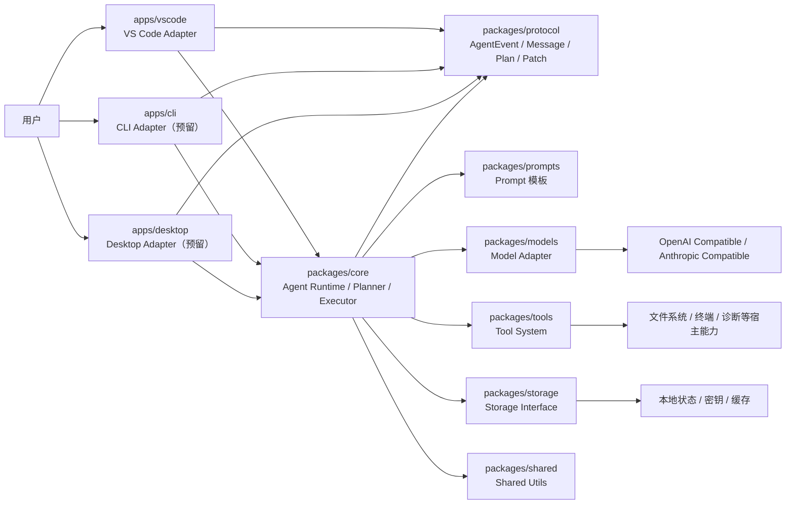

# Helix Agent 系统架构

## 1. 这份文档解决什么问题

这份文档只回答一件事：

Helix Agent 这个项目，为什么要拆成 `apps/*` 和 `packages/*` 两层，以及这些层各自负责什么。

先说结论：

- Helix 不是普通聊天插件
- VS Code 只是第一版客户端
- 真正的核心是可复用的 Agent Core
- UI、宿主能力、模型适配、工具系统、事件协议都应该各自分层

## 2. 当前目录骨架

当前仓库已经建立了下面的 monorepo 结构：

```text
helix-agent/
├── apps/
│   ├── vscode/
│   ├── cli/
│   └── desktop/
├── packages/
│   ├── core/
│   ├── protocol/
│   ├── shared/
│   ├── models/
│   ├── tools/
│   ├── storage/
│   ├── prompts/
│   └── sdk/
└── docs/
```

现在这些目录大多还是工程骨架，但目录职责已经应该先定义清楚，否则后面写代码时很容易把边界写乱。

## 3. 总体架构图



## 4. 为什么要分成两层

最容易犯的错，是把所有逻辑都堆进 `apps/vscode`。

这样短期看起来快，长期会出现三个问题：

1. Runtime 和 VS Code API 耦合，后面没法复用到 CLI 或桌面端。
2. 规划、执行、工具调度、上下文治理会和 UI 混在一起，代码很快失控。
3. 一旦想支持第二个客户端，就要重写核心逻辑。

所以这个项目从 Day 1 起就要坚持：

- `apps/*` 负责“接入宿主”
- `packages/*` 负责“承载核心能力”

## 5. apps/vscode 和 packages/core 的边界

### 5.1 apps/vscode 负责什么

`apps/vscode` 是 VS Code 适配层，不是 Agent 的大脑。

它应该负责：

- Sidebar UI
- Webview 与 Extension Host 的消息通信
- SecretStorage 接入
- WorkspaceEdit / diff preview 接入
- Terminal 接入
- Diagnostics 接入
- 当前编辑文件、选中代码、工作区等宿主信息读取

它不应该负责：

- 规划逻辑
- 执行逻辑
- Prompt 拼装策略
- Tool 调度策略
- Model 路由策略
- Context Builder

一句话理解：

`apps/vscode` 只负责“把 VS Code 能力接进来”，不负责“决定 Agent 怎么思考和执行”。

### 5.2 packages/core 负责什么

`packages/core` 是 Agent Core，也是整个项目最值钱的部分。

它应该负责：

- 任务运行时
- 普通模式 / 规划模式切换
- Planner 调用
- Executor 调用
- Tool Registry 协调
- 上下文构建与裁剪
- 工具结果治理
- 结果输出为统一事件流

一句话理解：

`packages/core` 负责把“一个用户任务”变成“可执行、可审查、可总结的完整过程”。

## 6. 各 package 的职责

### 6.1 packages/protocol

这是协议层。

它负责定义项目里的共享数据结构，例如：

- Message
- Conversation
- AgentTask
- AgentPlan
- ToolCall
- ToolResult
- ApprovalRequest
- AgentEvent

为什么单独拆出来：

- UI 要读这些类型
- Core 要产出这些类型
- 后续 CLI、Desktop 也要复用这些类型

如果协议层不独立，类型会散落在各处，后面一定会互相打架。

### 6.2 packages/models

这是模型适配层。

它负责把不同模型提供方统一成项目自己的抽象接口，例如：

- OpenAI Compatible Provider
- Anthropic Compatible Provider
- 后续其他兼容 Provider

它不应该让上层直接感知每家厂商的请求细节。

这样做的好处是：

- 用户可以自定义模型
- Runtime 不需要知道每家 API 的具体差异
- 后面扩新 provider 不会把 Core 改烂

### 6.3 packages/tools

这是工具系统。

它负责：

- 定义工具接口
- 注册工具
- 区分只读工具和副作用工具
- 描述哪些工具需要审批

MVP 阶段的重点工具包括：

- `read_file`
- `search_text`
- `list_directory`
- `glob_files`
- `get_diagnostics`
- `apply_patch`
- `run_terminal`

这里的关键原则是：

- 只读工具可以服务于探索和规划
- 有副作用工具必须进入审批链路

### 6.4 packages/storage

这是存储抽象层。

它负责统一管理：

- 敏感配置
- 非敏感配置
- 会话状态
- 计划缓存
- 工具结果摘要

为什么不直接把这些逻辑写死在 `apps/vscode`：

因为 SecretStorage 只是 VS Code 的一种宿主实现，不应该成为整个项目唯一的存储边界。

### 6.5 packages/prompts

这是 Prompt 模板层。

它负责：

- 固定规划模式的 prompt 骨架
- 固定执行模式的 prompt 骨架
- 保持请求前缀稳定

这个层很重要，因为 Helix 的目标不是“多说话”，而是“更省上下文、更稳、更可缓存”。

### 6.6 packages/shared

这是共享基础层。

它只放低风险、无业务倾向、可复用的公共能力，例如：

- 通用工具函数
- 通用错误结构
- 通用小型辅助类型

它不应该变成“什么都往里塞”的垃圾桶。

### 6.7 packages/sdk

这是预留扩展层。

当前阶段可以先保留骨架，不急着塞内容。

它未来适合承载：

- 对外暴露的 SDK 能力
- 第三方扩展接入点
- 更开放的能力封装

MVP 阶段不应该因为它存在，就提前做复杂开放能力设计。

## 7. 为什么 Core 不能依赖 VS Code

这是整个项目最重要的架构边界。

### 7.1 直接原因

如果 `packages/core` 里直接 `import vscode`，马上会出现这些问题：

- Core 无法在 CLI 环境运行
- Core 无法在未来桌面端复用
- 单元测试会被 VS Code 环境绑死
- 规划、执行、工具调度会和宿主 API 强耦合

### 7.2 更深层原因

Helix 的目标不是“做一个 VS Code 聊天框”，而是“做一个独立的本地 Agent Engine”。

既然 Core 是 Engine，它就应该只依赖抽象接口，例如：

- DiagnosticsPort
- FileSystemPort
- TerminalPort
- ApprovalPort
- SecretStorage 的抽象接口

真正的 VS Code API 应该由 `apps/vscode` 去实现这些接口，然后再把实现注入给 Core。

### 7.3 一个简单类比

可以把 Core 理解成发动机，把 `apps/vscode` 理解成车身和驾驶舱。

- 发动机负责动力和运行规则
- 驾驶舱负责按钮、显示、交互

如果把方向盘焊到发动机里面，后面你想换另一种车身，几乎就得全部重做。

## 8. 为什么要通过 AgentEvent 事件流连接 UI

UI 和 Runtime 最容易耦合的地方，就是“结果怎么传递”。

如果 UI 直接依赖 Runtime 内部对象或方法调用顺序，会出现两个问题：

1. UI 很难做流式展示、审批卡片、工具记录等多形态渲染。
2. Runtime 一改内部实现，UI 就容易跟着崩。

所以更稳的方式是：

- Runtime 只输出标准化事件
- UI 只消费标准化事件

这就是 `AgentEvent` 的意义。

### 8.1 事件流的好处

第一，解耦。

UI 不需要知道 Runtime 内部具体怎么调用 Planner、Executor、Tool，只需要知道“现在发出了什么事件”。

第二，可扩展。

以后不只是 VS Code，要是 CLI 也想展示执行过程，也可以消费同一套事件。

第三，可审计。

审批请求、工具调用、错误、计划生成、任务完成，都可以沉淀成清晰的事件轨迹。

### 8.2 一个典型流程

一个用户任务在事件流里的大致过程可以是：

1. `task.created`
2. `plan.started`
3. `plan.created`
4. `tool.called`
5. `tool.completed`
6. `approval.requested`
7. `patch.generated`
8. `task.completed`

UI 只要根据事件类型渲染对应卡片或消息即可。

## 9. Day 3 之后写代码时必须长期坚持的规则

### 9.1 关于边界

- `packages/core` 不能 import `vscode`
- `apps/vscode` 不要承载 Agent 业务逻辑
- Tool、Model、Storage 都要通过抽象边界接入 Core

### 9.2 关于职责

- Protocol 负责类型和事件
- Core 负责运行时和执行链路
- Models 负责统一模型适配
- Tools 负责工具系统
- Storage 负责状态与配置抽象
- VS Code 负责宿主接入和 UI

### 9.3 关于未来扩展

未来可以增加：

- CLI
- Desktop
- 更多模型
- 更多工具

但这些扩展都不能破坏“Core 不依赖 VS Code”这条红线。

## 10. 小结

Helix 的系统架构可以浓缩成一句话：

**用 `packages/core` 承载真正的 Agent Engine，用 `apps/vscode` 负责宿主适配，用 `packages/protocol` 的事件流把两者稳定连接起来。**

只要这条线不乱，后面的 Runtime、Tool、Planner、Approval、Context 才有机会越做越稳。
